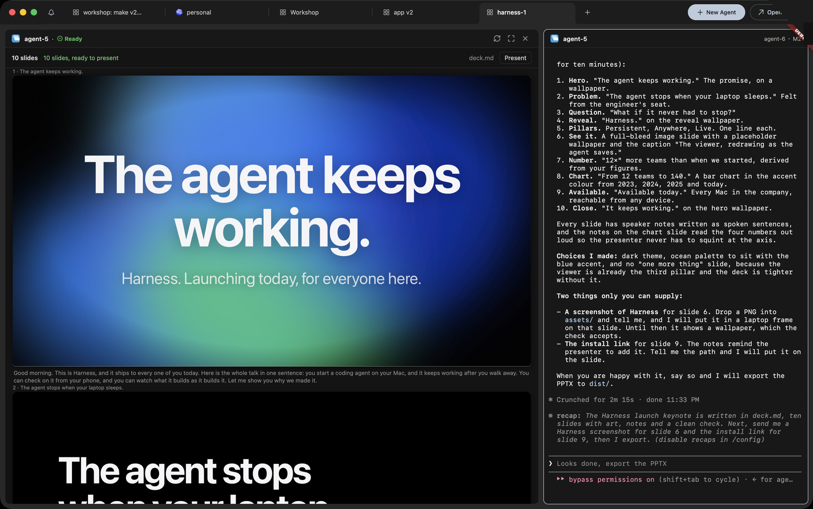
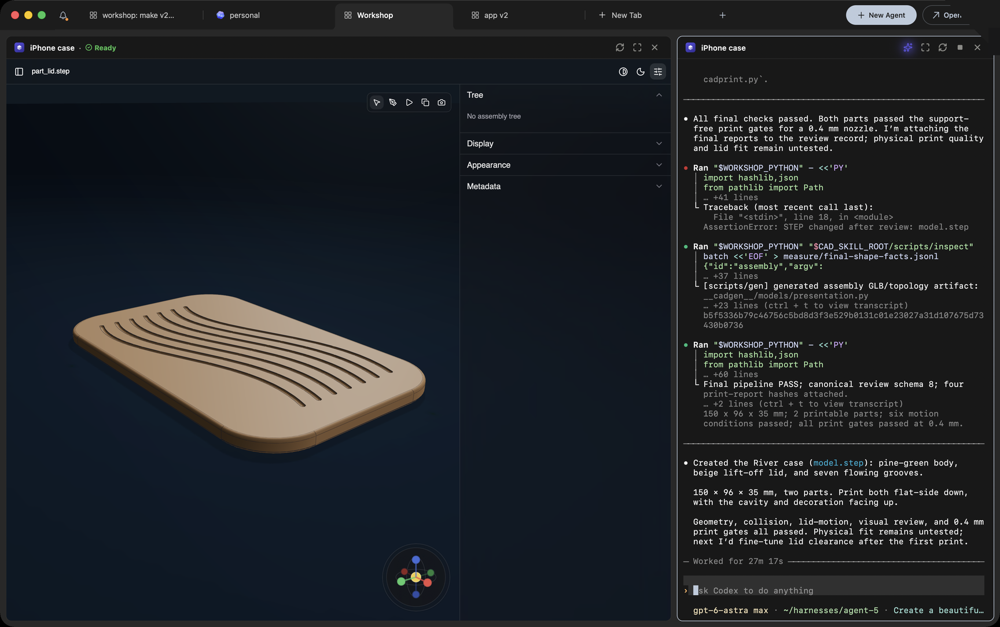
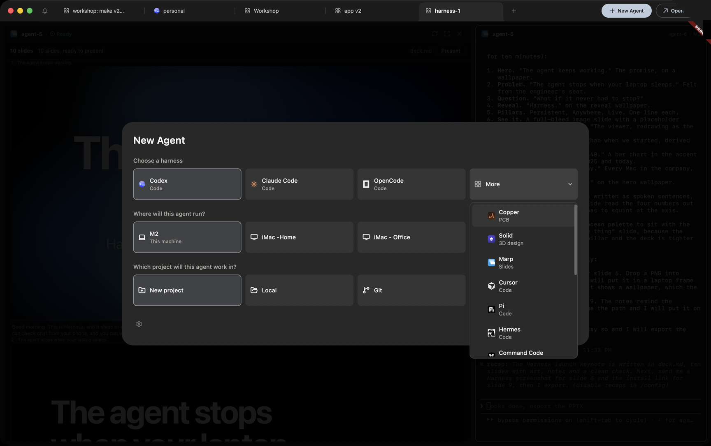
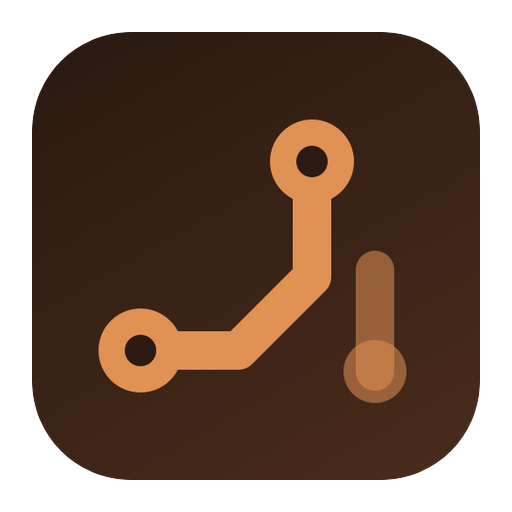
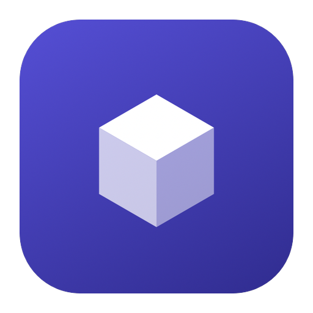
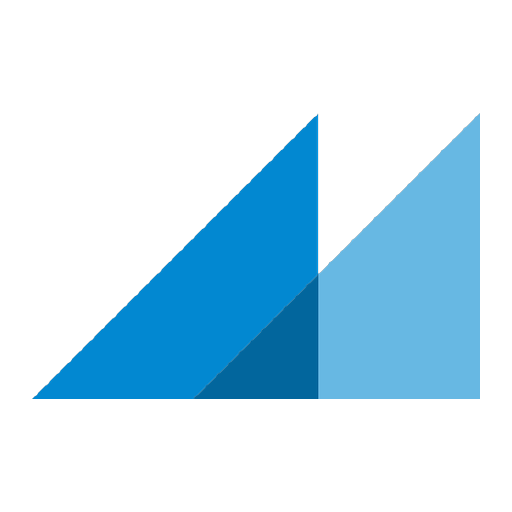

https://github.com/user-attachments/assets/97848065-61c6-40df-be66-a8247f69aa4c

# Harness

Agents that build things, in one window. Code with Claude Code, Codex, Cursor and eleven more. PCBs
with Copper. 3D parts with Solid. Keynotes with Marp. Every agent runs in a persistent terminal on
any machine you own, and the domains beyond code get a viewer beside it that shows the work as it
is made.

<p align="center">
  
</p>

## Why Harness

- **More than code.** Copper (PCB), Solid (3D design) and Marp (Slides) sit beside the coding
  agents. One prompt, and the pane fills with the board, the part, the keynote while the agent works.
- **Your agents, unwrapped.** Fourteen engines. Harness reads the transcript each one already writes
  and installs the vendor's own hooks; it never wraps a CLI. Credentials stay in your `~/.claude`,
  `~/.codex`, and so on.
- **Sessions that outlive the laptop.** Every agent is a tmux pane on its machine, kept by a small
  daemon. Close the lid, open it on the train: same pane, same scrollback. After a reboot the daemon
  brings each one back with the engine's own `--resume`.
- **Every machine, no SSH.** Laptop, the Mac mini at home, the box in the rack, side by side. Each
  machine dials out; nothing to open; encrypted end to end through a relay that holds no keys.
- **Built for the keyboard.** ⌘N for a new agent, ⌘O to find anything, ⌘B to say what you want and
  have it land on the right agent. Every key remappable in one file.
- **A device for the desk.** A round USB display with your agents as tiles, their questions
  answerable with a tap, and a voice turn a double-tap away.

## Harnesses

| Harness | You say | You get | You watch |
|---|---|---|---|
| **Claude Code, Codex, Cursor, …** · Code | "add OAuth to the API" | the change, in your repo | the agent's terminal |
| **Copper** · PCB | "a USB-C powered ESP32 sensor board" | a fab-ready board, ordered in a click | the board, its checks, the fab |
| **Solid** · 3D design | "an iPhone case with a lanyard loop" | a printable STEP part | the model: Build, Fit, Print, Review |
| **Marp** · Slides | "a launch keynote for 200 engineers" | a keynote with art and speaker notes | the slides filling in, then Present |
| **Yours** | | anything an agent can build in a folder | [build a harness](#extend-harness) |

<p align="center">
  
</p>

Every harness is the same thing to the app: a tile in New Agent, a tab with the terminal on the
right and the domain's viewer on the left, and a header that says where the work is. The domain
lives in its own git repository, installed on first use, never in Harness itself.

<p align="center">
  
</p>

<p align="center">
  
  &nbsp;&nbsp;
  
  &nbsp;&nbsp;
  
  &nbsp;&nbsp;
  
  &nbsp;&nbsp;
  
  &nbsp;&nbsp;
  
  &nbsp;&nbsp;
  
  &nbsp;&nbsp;
  
  &nbsp;&nbsp;
  
  &nbsp;&nbsp;
  
  &nbsp;&nbsp;
  
  &nbsp;&nbsp;
  
  &nbsp;&nbsp;
  
  &nbsp;&nbsp;
  
</p>

And the harnesses for the domains beyond code, each on one of those agents:

<p align="center">
  
  &nbsp;&nbsp;
  
  &nbsp;&nbsp;
  
</p>

## Install

**macOS 12+ (Apple Silicon and Intel), Linux (Ubuntu 22.04+).** Download the app from
[harness.autonomous.ai/desktop](https://harness.autonomous.ai/desktop). On first launch it checks for
tmux, installs a managed Node 20 and the `harness` daemon under `~/.harness`, signs you in with SSO,
and starts the daemon. This computer is your first machine.

**Add another machine** — a server, a Mac mini, a container — with the daemon alone. Node ≥ 20 and
tmux are the prerequisites; `sqlite3` is needed only for the engines that keep their conversations in
SQLite (OpenCode, Kilo, Hermes, Devin).

```bash
curl -fsSL https://harness.autonomous.ai/cli/install.sh | bash
harness login      # browser SSO, saves this computer's session
harness start      # connects; reconnects to the same machine on every later start
```

It appears in the app's machine list within a minute. There is no token to copy: a durable computer
id under `~/.harness` keeps later starts attached to the same machine record.

One thing to know from the start: **the daemon only knows about panes it created.** Sessions you start
from the app or the web are tmux sessions named `harness-*`, owned by the daemon. A `claude` you launch
by hand in your own tmux is not picked up.

## First five minutes

**⌘N** New Agent: a harness, a machine, a folder, Create. **⌘O** finds any agent, tab, project or
machine, and `>` runs a command. **⌘B** takes a task in plain words and routes it to the agent
already on it. **⌘R** and **⌘D** split, **⌘S** picks a layout, **⌘⏎** zooms a pane, **⇧⌘I** lists
the agents waiting on you. The full keymap, and how to remap it: [docs/keyboard.md](docs/keyboard.md).
The window in detail: [docs/app.md](docs/app.md).

## Extend Harness

Every layer has a contract, a starter and a check.

| Add | Start at | The bar |
|---|---|---|
| a **domain harness**: PCB, CAD, slides, yours | [`dsh/README.md`](dsh/README.md), [`dsh/starter-dsh/`](dsh/starter-dsh/) | `harness dsh check .` |
| an **agent** as a CLI engine | [`cli/src/engines/README.md`](cli/src/engines/README.md) | the recorded-session fixtures pass |
| an **agent** as an API provider | [`provider/README.md`](provider/README.md) | the conformance runner, zero failures |
| a **terminal multiplexer** | [CONTRIBUTING.md](CONTRIBUTING.md#adding-a-multiplexer) | `npm run test:tmux-real` |
| a **palette** or terminal theme | [`docs/extending.md`](docs/extending.md#palettes-and-appearance) | `flutter test` |
| a **keymap** | `~/.config/harness/keybindings.jsonc`, no code | it reloads on save |
| **automation** over the daemon | [`docs/cli.md`](docs/cli.md#automation) | the loopback socket answers |

**A domain harness** is a git repository: a manifest, an `AGENTS.md`, skills, a workspace template,
a toolchain that installs itself, and for the pane a viewer server and a verdict file. Harness reads
the manifest and nothing else about its code. Copy the starter, `harness dsh check .`,
`harness dsh install . --link`, and your tile is in New Agent. One registry file in a pull request
lists it for everyone. [Marp](https://github.com/autonomous-ai/autonomous-marp) is the smallest
complete one and the place to start; [Copper](https://github.com/autonomous-ai/autonomous-circuit)
and [Solid](https://github.com/autonomous-ai/autonomous-workshop) are the big ones.

**An agent** is a CLI engine, a normalizer in this repo written from a recorded session of the real
binary, or an API provider, eight JSON-RPC methods on your own infrastructure. Both are first-class:
[docs/extending.md](docs/extending.md).

## Contribute

Harness gets better in more ways than pull requests here.

- **Build a harness for your domain** and list it in [`dsh/registry/`](dsh/registry/). It is a
  product on its own, and it never touches this code.
- **Bring your agent** as an engine or a provider.
- **Record a session.** An engine bug is fixed from a real recorded session of the real binary.
  Attach one to the issue and it is half done.
- **A palette, a terminal theme, a keymap** you are proud of.
- **Docs.** What confused you in the first five minutes is the next fix.

Open an issue before writing an engine or a multiplexer so the shape and the software a maintainer
needs to reproduce it are agreed first. [CONTRIBUTING.md](CONTRIBUTING.md) has the workflow,
[SECURITY.md](SECURITY.md) takes security reports, and the licence is [MIT](LICENSE).

## Docs

- [docs/app.md](docs/app.md) — sessions, panes, layouts, terminal, attention, machines
- [docs/keyboard.md](docs/keyboard.md) — the full keymap and the keymap file
- [docs/engines.md](docs/engines.md) — the fourteen engines: how each is followed, resume, bypass, grids
- [docs/architecture.md](docs/architecture.md) — daemon, session model, transport and encryption, relay, providers, the device
- [docs/cli.md](docs/cli.md) — every `harness` command, the dashboard, the loopback socket
- [docs/extending.md](docs/extending.md) — agents, multiplexers, palettes, keys, automation
- [docs/development.md](docs/development.md) — repository layout, build, test, release
- [dsh/README.md](dsh/README.md) — build a domain harness; [dsh/spec/](dsh/spec/README.md) is the contract
- [cli/](cli/README.md), [desktop/](desktop/README.md), [backend/](backend/README.md), [provider/](provider/README.md) — per-package detail
