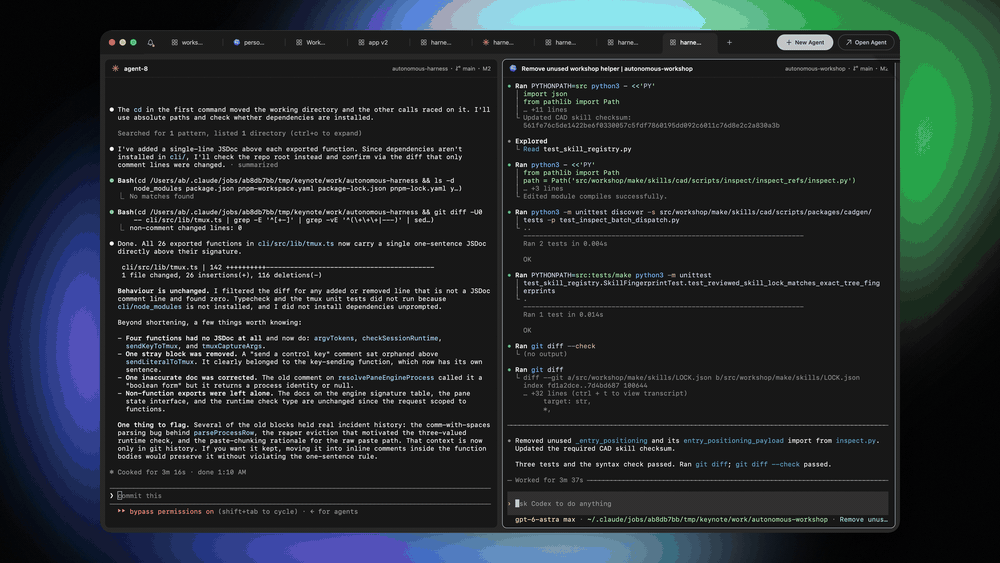

# OpenHarness

An open-source framework for running coding agents with domain-specific tools and live viewers.

OpenHarness runs Claude Code, Codex, OpenCode, and other engines in persistent terminal sessions.
A **harness** adds instructions, tools, a project template, and a viewer for the output. You chat
with the agent on the right; the model, board, game, or document updates on the left. The viewer
stays interactive while the agent works and after it finishes.

The package format is small on purpose: a folder and a `harness.json`. If you've wired a coding
agent to a tool you use, you can package that workflow without changing the desktop app.

[Install](#run-it) · [Make a harness](#make-a-harness) · [Architecture](docs/architecture.md) ·
[Contribute](CONTRIBUTING.md)

<p align="center">
  
</p>

## Run it

1. [Download the desktop app](https://harness.autonomous.ai/desktop).
2. Set up a supported coding engine with your own subscription, API key, or local model configuration.
3. Install a harness from the Store. Press **⌘N**, choose the harness, machine, and project, and start a session.

**Current support:** macOS is the primary tested platform, including embedded viewers. Linux builds
exist, but feature parity is in progress. Windows support is also work in progress.

**Current limitation:** desktop and daemon startup still require a Harness account.
[Account-free local use is tracked](docs/development.md#account-free-local-use); sign-in should
only be necessary to link remote machines. Engine authentication is separate.

### Build from source

For macOS, install Node.js 20+, tmux, Xcode, and Flutter 3.47+ / Dart 3.13+:

```bash
git clone https://github.com/autonomous-ai/openharness.git
cd openharness
(cd cli && npm ci)
make install-cli
cd desktop
flutter config --enable-swift-package-manager
flutter pub get
flutter run -d macos
```

`make install-cli` installs this checkout's CLI and restarts the local daemon.
The [development guide](docs/development.md) covers tests and isolated environments.
Individual harnesses may need additional tools; their setup and doctor commands handle those checks.

## Make a harness

The [Hello World example](store/examples/hello-world/) is a Codex session that edits an HTML page
shown in the shared Web Viewer:

```text
hello-world/
  harness.json
  AGENTS.md             # instructions for the agent
  template/index.html   # copied into a new project
```

Its manifest connects the pieces:

```json
{
  "spec": 1,
  "id": "examples/hello-world",
  "name": "Hello World",
  "engine": "codex",
  "workspace": {
    "template": "template",
    "marker": "index.html"
  },
  "agent": { "instructions": "AGENTS.md" },
  "viewer": { "use": "autonomous/web-viewer" }
}
```

From this checkout, with the `harness` CLI installed:

```bash
harness dsh install "$PWD/store/viewers/web-viewer" --link
cp -R store/examples/hello-world ../my-first-harness
harness dsh check ../my-first-harness
harness dsh install ../my-first-harness --link
```

Press **⌘N → Hello World**, choose a new project, and ask it to “Say hello to Ada.” The agent edits
`index.html`; the viewer reloads. Change `AGENTS.md` to try another workflow, then start a new
session. Add skills, setup scripts, and checks as needed.

The first install command links the viewer from your checkout. Normal Store installs resolve
viewer dependencies automatically and reuse viewers already installed on that machine.
`--link` keeps the package connected to your source directory.

The [authoring guide](store/README.md) covers the full manifest, toolchains, live progress,
verification, and publishing. DSH means *domain-specific harness*; that's the name used by the CLI
and package protocol.

### The pieces

| Piece | Responsibility |
|---|---|
| Engine | Runs the coding agent: Claude Code, Codex, OpenCode, etc. |
| Harness | Packages a workflow: engine, instructions, tools, workspace, and optional viewer |
| Viewer | Displays and interacts with project output; can be shared by harnesses |
| Session | One running agent in a project on a machine |

Domain code stays in the package. The platform reads the manifest, prepares the workspace, starts
the processes, and watches the declared verdict file. Adding a harness on an existing engine
shouldn't require a change to the app or daemon.

## Existing harnesses

The packages in [`store/agents/`](store/agents/) wrap these tools and workflows:

| Domain | Packages |
|---|---|
| CAD | [Autonomous Workshop](store/agents/autonomous-workshop/), [text-to-cad](store/agents/text-to-cad/) |
| 3D | [Blender](store/agents/blender/) |
| Electronics | [Autonomous Circuit](store/agents/autonomous-circuit/), [CircuitJS](store/agents/circuitjs/), [Yosys](store/agents/yosys/) |
| Games | [Phaser](store/agents/phaser/) |
| Documents and diagrams | [Marp](store/agents/marp/), [Typst](store/agents/typst/), [Excalidraw](store/agents/excalidraw/) |
| Video and music | [Remotion](store/agents/remotion/), [Manim](store/agents/manim/), [Strudel](store/agents/strudel/) |
| Simulation and analysis | [MuJoCo](store/agents/mujoco/), [RDKit](store/agents/rdkit/), [marimo](store/agents/marimo/) |

Each package credits its upstream project and documents its dependencies and license.
The [engine list](docs/engines.md) covers the coding CLIs the platform can launch.

## Terminal workspace

The desktop app uses real terminals backed by persistent tmux sessions. Closing the window does
not end the agents. Panes can contain terminals or viewers, and the layout is keyboard-driven.

| Shortcut | Action |
|---|---|
| **⌘N** | Start a harness |
| **⌘O** | Fuzzy-find sessions, projects, tabs, and machines; `>` opens commands |
| **⌘H / J / K / L** | Move between panes |
| **⌘Enter** | Zoom a pane or restore the layout |
| **⌘R / ⌘D** | Split right / down |
| **⌘S** | Choose a layout |
| **⇧⌘I** | Find agents waiting for input |

[Keybindings](docs/keyboard.md) are configurable. See the [workspace guide](docs/app.md) for tabs,
layouts, search, and session behavior.

## Multiple machines

Each machine runs a daemon that makes outbound connections. Linked machines use end-to-end
encryption for terminal traffic; the relay forwards ciphertext. Direct WebRTC connections are
used when available. No SSH server, VPN, or inbound port forwarding is required.

On another supported machine:

```bash
curl -fsSL https://harness.autonomous.ai/cli/install.sh | bash
harness login
harness start
```

Use **Machines → Link Machine** in the app to link it.
The [architecture docs](docs/architecture.md) describe transport, identity, and encryption.

## Device firmware

[`device/harness/`](device/harness/) contains ESP32-S3 firmware for a round USB companion display.
It shows agent status and supports responses and voice input through the host daemon.
The device connects over USB; it doesn't need Wi-Fi credentials.

Build and flash it onto a supported board, or add a board port. Schematics and enclosure designs
are not in the repository yet. The [hardware guide](device/harness/README.md) lists the current
boards and build commands.

https://github.com/user-attachments/assets/97848065-61c6-40df-be66-a8247f69aa4c

## Contributing

A good first PR is a harness for a tool you already use. Start with the example, make one workflow
work end to end, and include a reproducible project. Pin the toolchain, credit upstream, and show
what someone can inspect or interact with in the viewer.

Packages can live in this repository or your own. You don't need to modify the platform to share
one. The [contribution guide](CONTRIBUTING.md) walks through both paths.

There's platform work too: terminal behavior, engine support, viewers, accessibility, Linux and
Windows support, and hardware ports. Small fixes and notes about something that didn't work are
useful contributions. Bring a workflow, try it, and help make it easier for the next person to use.

## Repository map

```text
desktop/    Flutter app and terminal workspace
cli/        TypeScript CLI, daemon, engine adapters, and package runtime
backend/    Relay and control plane
store/      Harnesses, shared viewers, registry, examples, and package spec
provider/   Provider API contract, implementations, and conformance tests
device/     Device firmware
```

- [Development and testing](docs/development.md) · [Extension points](docs/extending.md)
- [Package specification](store/spec/README.md) · [CLI and automation](docs/cli.md)
- [Desktop](desktop/README.md) · [Daemon](cli/README.md) · [Relay](backend/README.md) · [Provider API](provider/README.md)
- [Security policy](SECURITY.md) · [License](LICENSE)

The app, framework, and firmware are MIT licensed. Upstream tools, models, and assets keep their own licenses.
